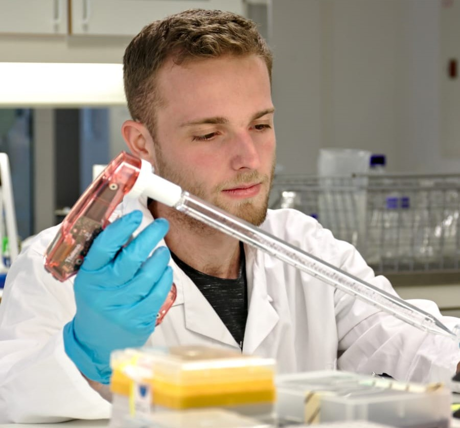

```{r setup, include=FALSE}
knitr::opts_chunk$set(echo = TRUE)
```


{ width=20%}
{ width=5%}


<h1>
Neurocast – Mogelijke functie
</h1>

<h2>
PROFIEL
</h2>

Met mijn motivatie en liefde voor problemen oplossen en mensen helpen hoop ik een goed deel te worden van jullie team. Ik geloof dat Neurocast een ideaal bedrijf is om een waanzinnige stage te volgen! 

<h2>
OPLEIDINGEN
</h2>

<h3>
BACHELOR: Biologie en Medisch Laboratoriumonderzoek (Life Sciences) 
</h3>

Hogeschool Utrecht | 2016 - Heden <br>
Specialisatie: Bio-informatica, Bio-moleculaire research

<h3>
MIDDELBARE SCHOOL: HAVO
</h3>

De Breul | 2009 - 2015 <br>
Profiel: Natuur & Techniek + Natuur & Gezondheid

<h2>
VAARDIGHEDEN
</h2>
<h3>
Bio-moleculaire research: 
</h3>
RNA/DNA isolatie			Reportergen assay <br>
(q)PCR 					Translocatie assay <br>
(In frame) kloneren 			Western blot <br>
Transformeren				Cel kweek <br>
Transfecteren				 
<h3>
Bio-informatica: 
</h3>
Werken met Databanken en Bash programming <br>
Programmeren met R en Bioconductor voor reproduceerbare data-analyse 			

<h2>
TALEN
</h2>
<h3>
Nederlands</h3>
Moedertaal
<h3>
Engels</h3>
Volledige beheersing 

<h3>
Duits</h3>
Basisvaardigheid | Aan het leren 

<h4>
BAS KOPPENAAL</h4>

<h5>
14 Augustus 1997 <br>
 06 576 92 158 <br>
Baskoppenaal@hotmail.com  
 <p><a href="http://www.linkedin.com/in/baskoppenaal" target="Wikipedia">LinkedIn profiel</a></p> 
La Traviatadreef 22 Utrecht</5>

<h4>
INTERESSES </h4>
<h5>
Dansen: Hip-Hop <br>
Hardlopen <br>
Fitness <br>
Duiken <br>
Reizen <br>
Schaken
</h5>

<h4>
Aanvullende activiteiten </h4>

<h5>
•	Mentor bij Utrechtse Introductie Tijd <br>
•	Mentor bij ESN
</h5>


```{r cars}


```
<div class="header">
</div>

<div class="row">
  <div class="column left">
    <h2>left</h2>
    <p>Lorem ipsum dolor sit amet, consectetur adipiscing elit..</p>
  </div>
  
  <div class="column middle">
    <h2>Main Content</h2>
    <p>Lorem ipsum dolor sit amet, consectetur adipiscing elit. Maecenas sit amet pretium urna. Vivamus venenatis velit nec neque ultricies, eget elementum magna tristique. Quisque vehicula, risus eget aliquam placerat, purus leo tincidunt eros, eget luctus quam orci in velit. Praesent scelerisque tortor sed accumsan convallis.</p>
    <p>Lorem ipsum dolor sit amet, consectetur adipiscing elit. Maecenas sit amet pretium urna. Vivamus venenatis velit nec neque ultricies, eget elementum magna tristique. Quisque vehicula, risus eget aliquam placerat, purus leo tincidunt eros, eget luctus quam orci in velit. Praesent scelerisque tortor sed accumsan convallis.</p>
  </div>

```{r pressure, echo=FALSE}


```

